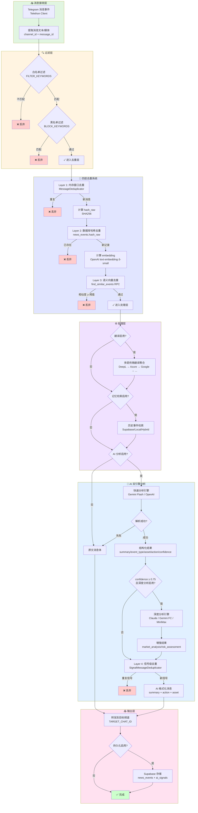

# tg-crypto-listener

一个面向加密市场的 Telegram 消息监听与智能信号转发服务。它在完成消息过滤、去重后，可选地接入翻译与 Gemini 推断，将快讯整理成结构化摘要与行动建议，并转发到你的目标频道或后续交易系统。

> 更完整的 AI 信号规划、演进路线可参考 `docs/ai_signal_plan_cn.md` 与 `docs/aisignalengine_implementation.md`。

## 核心特点
- **多源监听**：基于 Telethon 订阅多个 Telegram 频道，支持关键词过滤与消息去重。
- **AI 结构化**：调用 Google Gemini 生成 JSON 结果（摘要、事件类型、action、confidence、risk_flags 等），遇到 503/超时自动降级为纯转发。
- **可选翻译**：聚合 DeepL、Azure、Google、Amazon、百度、阿里云、腾讯云、华为云、火山、NiuTrans 等主流翻译 API，自动轮询/回退,优先消耗免费额度。
- **可观测性**：周期性输出运行统计，便于监控转发、AI 成功率、错误等指标。

## 数据流转架构

### 流程图



### 数据契约（Data Contract）

#### 1. 输入数据（Telegram Message）
```python
{
    "message_id": int,              # Telegram 消息 ID
    "channel_id": int,              # 来源频道 ID
    "text": str,                    # 消息文本（可能包含 URL/emoji）
    "date": datetime,               # 消息时间戳
    "media": Optional[bytes],       # 媒体内容（照片/文档，base64 编码）
    "sender_id": int                # 发送者 ID
}
```

#### 2. 过滤后数据（Filtered Message）
```python
{
    **telegram_message,             # 继承输入数据
    "matched_keywords": List[str],  # 命中的白名单关键词
    "filter_pass": bool             # 是否通过过滤
}
```

#### 3. 去重层数据（Deduplicated Message）
```python
{
    **filtered_message,
    "hash_raw": str,                # SHA256(text) 哈希值
    "hash_translated": Optional[str], # SHA256(translated_text)（如启用翻译）
    "embedding": List[float],       # 1536 维向量（OpenAI embedding）
    "dedup_status": str             # "unique" | "duplicate_hash" | "duplicate_semantic"
}
```

#### 4. 翻译层数据（Translated Message）
```python
{
    **deduplicated_message,
    "translated_text": Optional[str],     # 翻译后的文本（目标语言 zh）
    "translation_provider": Optional[str], # 使用的翻译提供商
    "translation_quota_used": int         # 消耗的字符配额
}
```

#### 5. 记忆层数据（Memory-Enhanced Message）
```python
{
    **translated_message,
    "similar_events": List[dict],   # 历史相似事件列表
    "memory_context": str           # 格式化的记忆上下文（注入到 AI prompt）
}
```

#### 6. AI 分析结果（AI Signal）
```python
{
    "summary": str,                 # 中文摘要（30-150 字）
    "event_type": str,              # 事件类型：listing/hack/regulation/partnership/market_analysis 等
    "asset": str,                   # 相关资产代码（2-10 大写字母）或 "NONE"
    "direction": str,               # 方向：bullish/bearish/neutral
    "action": str,                  # 建议操作：buy/sell/observe
    "confidence": float,            # 置信度 0.0-1.0
    "risk_flags": List[str],        # 风险标记：["low_liquidity", "high_volatility"]
    "deep_analysis": Optional[dict] # 深度分析结果（market_analysis/risk_assessment/key_factors）
}
```

#### 7. 输出数据（Final Message）
```python
{
    **ai_signal,
    "formatted_text": str,          # 格式化的转发消息
    "forwarded_at": datetime,       # 转发时间戳
    "news_event_id": Optional[int], # 数据库记录 ID（如启用持久化）
    "ai_signal_id": Optional[int]   # AI 信号记录 ID
}
```

### 关键环节说明

#### 1️⃣ 四层去重系统（Deduplication Layers）

| 层级 | 实现位置 | 去重策略 | 时间窗口 | 配置参数 |
|------|---------|---------|---------|---------|
| **L1** | `MessageDeduplicator` | 内存哈希表 + 滑动窗口 | 4-24 小时 | `DEDUP_WINDOW_HOURS` |
| **L2** | `news_events.hash_raw` | 数据库精确匹配 | 永久 | - |
| **L3** | `find_similar_events()` RPC | 向量余弦相似度 | 7 天 | `OPENAI_EMBEDDING_MODEL`<br/>`similarity_threshold=0.85` |
| **L4** | `SignalMessageDeduplicator` | 信号摘要相似度 + 元数据匹配 | 4-6 小时 | `SIGNAL_DEDUP_WINDOW_MINUTES`<br/>`SIGNAL_DEDUP_SIMILARITY` |

**去重触发点**：
- L1-L3：预处理阶段（AI 分析前）
- L4：后处理阶段（AI 分析后、转发前）

**为什么需要 L4？**
不同来源可能报道同一事件，经过 AI 分析后生成相似摘要（如"币安上线 XRP 现货"），L4 防止向用户重复推送相同信号。

#### 2️⃣ AI 双引擎架构（Dual-Engine AI Analysis）

```
┌─────────────────────────────────────────────────────────┐
│                   所有消息（100%）                        │
│                          ↓                              │
│              快速分析引擎（Primary Engine）               │
│            Gemini Flash / OpenAI / DeepSeek            │
│                   90% 成功率                            │
│                          ↓                              │
│              ┌───────────┴───────────┐                 │
│              ↓                       ↓                  │
│      confidence < 0.75        confidence ≥ 0.75        │
│          直接转发                     ↓                  │
│                           触发深度分析引擎               │
│                          （条件执行，~10%）              │
│                      Claude / Gemini FC                │
│                                ↓                        │
│                       增强结果（深度洞察）                │
└─────────────────────────────────────────────────────────┘
```

**引擎切换逻辑**（`src/ai/signal_engine.py:279`）：
1. 所有消息先经过快速引擎（低成本、高并发）
2. 高置信度信号（≥ 0.75）且满足以下条件时触发深度引擎：
   - `DEEP_ANALYSIS_ENABLED=true`
   - 距上次深度分析 ≥ `DEEP_ANALYSIS_MIN_INTERVAL` 秒（默认 25s）
3. 深度引擎失败时自动回退到快速引擎结果

**成本优化**：
- 快速引擎：$0.075/1M tokens（Gemini Flash）
- 深度引擎：$3/1M tokens（Claude Sonnet 4.5）
- 触发率：~10%（仅高价值信号）
- 综合成本：~$0.30/1M tokens

#### 3️⃣ 翻译聚合器（Translation Aggregator）

**Provider 优先级队列**（`src/ai/translator.py`）：
```
DeepL（50万字符/月）
    ↓ 配额耗尽/失败
Azure（200万字符/月）
    ↓ 配额耗尽/失败
Google Cloud（50万字符/月）
    ↓ 配额耗尽/失败
Amazon Translate（200万字符/月）
    ↓ 配额耗尽/失败
...（10+ 提供商）
    ↓ 全部失败
返回原文 + warning 日志
```

**配额管理**：
- 内存计数器跟踪每个 provider 的字符消耗
- 可通过 `TRANSLATION_PROVIDER_QUOTAS` 覆盖默认配额
- 支持运行时动态调整优先级

#### 4️⃣ 记忆系统（Memory System）

| Backend | 实现 | 检索方式 | 延迟 | 适用场景 |
|---------|-----|---------|------|---------|
| **Local** | 本地 JSON 文件 | 关键词匹配 | <10ms | 开发/测试环境 |
| **Supabase** | PostgreSQL + pgvector | 向量相似度 | 50-200ms | 生产环境（精确召回） |
| **Hybrid** | Local + Supabase | 关键词 → 向量回退 | 10-200ms | 高可用场景 |

**检索流程**：
1. 提取消息关键信息（asset/event_type）
2. 查询历史相似事件（最多 `MEMORY_MAX_NOTES` 条）
3. 格式化为上下文文本注入到 AI prompt
4. AI 基于历史事件做出更准确的判断

**注意事项**：
- 记忆检索可能增加 50-200ms 延迟
- 建议在高价值场景启用（如深度分析）
- 可通过 `MEMORY_ENABLED=false` 关闭以降低延迟

#### 5️⃣ 持久化层（Persistence Layer）

**数据库表设计**（Supabase PostgreSQL）：

```sql
-- 原始事件表
CREATE TABLE news_events (
    id BIGSERIAL PRIMARY KEY,
    channel_id BIGINT NOT NULL,
    message_id BIGINT NOT NULL,
    text TEXT NOT NULL,
    translated_text TEXT,
    hash_raw TEXT NOT NULL UNIQUE,      -- SHA256 哈希索引
    hash_translated TEXT,
    embedding vector(1536),             -- pgvector 扩展
    created_at TIMESTAMPTZ DEFAULT NOW()
);

-- 向量相似度检索索引
CREATE INDEX ON news_events USING ivfflat (embedding vector_cosine_ops);

-- AI 信号表
CREATE TABLE ai_signals (
    id BIGSERIAL PRIMARY KEY,
    news_event_id BIGINT REFERENCES news_events(id),
    summary TEXT NOT NULL,
    event_type TEXT NOT NULL,
    asset TEXT NOT NULL,
    direction TEXT,
    action TEXT NOT NULL,
    confidence NUMERIC(3,2) CHECK (confidence BETWEEN 0 AND 1),
    risk_flags TEXT[],
    deep_analysis JSONB,                -- 深度分析结果（可选）
    created_at TIMESTAMPTZ DEFAULT NOW()
);
```

**存储时机**：
- 消息转发成功后异步持久化（避免阻塞主流程）
- 失败消息也会存储（用于后续分析）
- 支持批量插入优化（未来规划）

## 环境要求
- Python 3.9 或以上（推荐 3.10+ 并使用 OpenSSL ≥ 1.1.1）。
- Telegram API ID / HASH / 手机号。
- （可选）Google Gemini / DeepL / Azure Translator / Amazon Translate / Google Cloud Translation / 百度翻译开放平台 / 阿里云机器翻译 / 腾讯云机器翻译 / 华为云机器翻译 / 火山引擎机器翻译 / 小牛翻译 API 凭证，根据需要启用。

## 快速开始
1. 克隆仓库并配置 `.env`（参考 `.env` 文件中注释，填写 Telegram、Gemini、DeepL 等凭证）。
2. 使用 `uvx` 一键安装依赖并启动监听：

   ```bash
   uvx --with-requirements requirements.txt python -m src.listener
   ```

   该命令会创建临时隔离环境、同步依赖，并直接运行 Telethon 监听器。

### 手动创建虚拟环境（备选方案）
```bash
python3 -m venv .venv
source .venv/bin/activate
source ./.venv/bin/activate  # macOS/Linux 切换已存在的虚拟环境
pip install -r requirements.txt
python -m src.listener
```

### 使用 PM2 常驻（推荐生产环境）
项目附带 `ecosystem.config.js` 和 `package.json` 中的脚本，可通过 npm + PM2 管理进程。配置使用 `uvx --with-requirements requirements.txt python -m src.listener` 自动拉起依赖：

```bash
# 一次性安装依赖并启动
npm install
npm run start

# 停止 / 重启 / 查看状态 / 查看日志
npm run stop
npm run restart
npm run status
npm run logs
```

PM2 会读取 `.env`，守护进程并在崩溃后自动拉起，也可配合 `pm2 monit` 查看实时资源占用。

## 关键配置（`.env`）
| 变量 | 说明 |
| --- | --- |
| `AI_ENABLED` | 是否启用 Gemini 信号分析（`true`/`false`）。|
| `AI_MODEL_NAME` | Gemini 模型名称（默认 `gemini-2.5-flash`）。|
| `AI_TIMEOUT_SECONDS` / `AI_RETRY_ATTEMPTS` / `AI_RETRY_BACKOFF_SECONDS` | AI 调用超时与重试策略。|
| `AI_MAX_CONCURRENCY` | 同时运行的 Gemini 请求数；遇到 503 可调低。|
| `AI_SKIP_NEUTRAL_FORWARD` | 当 AI 判定为观望/低优先级时是否直接跳过转发。|
| `ANTHROPIC_BASE_URL` / `ANTHROPIC_API_KEY` | Claude 兼容服务所需的 Base URL 与 API Key。|
| `MINIMAX_BASE_URL` / `MINIMAX_API_KEY` | 使用 MiniMax OpenAI 兼容 API 时的专属域名与凭证（默认 `https://api.minimax.io/v1`），优先使用 `MINIMAX_API_KEY`，未设置时可使用 `OPENAI_API_KEY`，设置后可配合 `DEEP_ANALYSIS_PROVIDER=minimax`。|
| `MINIMAX_MODEL` | MiniMax OpenAI 兼容模型名（默认 `gpt-4-turbo`），可根据套餐替换为其他模型。|
| `USE_LANGGRAPH_PIPELINE` | 启用 LangGraph 消息处理管线（实验特性，默认 `false`）。|
| `TRANSLATION_ENABLED` | 是否启用翻译聚合模块。|
| `TRANSLATION_PROVIDERS` | 翻译服务优先级列表，默认包含 `deepl,azure,google,amazon,baidu,alibaba,tencent,huawei,volcano,niutrans`。|
| `TRANSLATION_TARGET_LANGUAGE` | 目标语言（默认 `zh`，使用 ISO 639-1）。|
| `TRANSLATION_PROVIDER_QUOTAS` | 可选的配额覆盖，格式 `provider:字符数`，例如 `tencent:5000000,deepl:500000`；未设置时按默认免费额度上限。|
| 各云厂商凭据 | 例如 `DEEPL_API_KEY`、`AZURE_TRANSLATOR_KEY`/`REGION`、`AMAZON_TRANSLATE_ACCESS_KEY`/`SECRET_KEY`/`REGION`、`GOOGLE_TRANSLATE_API_KEY`、`BAIDU_TRANSLATE_APP_ID`/`SECRET_KEY`、`ALIBABA_TRANSLATE_APP_KEY`/`ACCESS_KEY_ID`/`ACCESS_KEY_SECRET`、`TENCENT_TRANSLATE_SECRET_ID`/`SECRET_KEY` 等 —— 仅在启用对应服务时必填。|
| `SOURCE_CHANNELS` / `TARGET_CHAT_ID` | Telegram 源频道与目标推送频道。|
| `FILTER_KEYWORDS_FILE` | 可选：关键词文件路径（默认读取仓库根目录的 `keywords.txt`，文件已加入 `.gitignore`，支持逗号分组与 `#` 注释）。|
| `FILTER_KEYWORDS` | 兼容旧版的备用配置；若同时存在，则会与文件中关键词合并。|
| `BLOCK_KEYWORDS` | 黑名单关键词（逗号分隔），包含这些关键词的消息将被直接过滤，不会进行后续处理。例如：`BLOCK_KEYWORDS=ASTER,SPAM,TRUMP,MAGA`。默认已包含低市值/政治 meme 代币（TRUMP, MAGA, PEPE2, FLOKI2, SHIB2, DOGE2, 币安人生），可在 `.env` 文件中自定义修改。|
| `DEDUP_WINDOW_HOURS` | 原始消息去重窗口（小时），默认 `24`。设为 `4` 表示检查最近 4 小时的消息。|
| `SIGNAL_DEDUP_ENABLED` | 是否启用 AI 信号去重（默认 `true`）。|
| `SIGNAL_DEDUP_WINDOW_MINUTES` | AI 信号去重窗口（分钟），默认 `360`（6 小时）。设为 `240` 表示 4 小时窗口。|
| `SIGNAL_DEDUP_SIMILARITY` | 信号相似度阈值 0.0-1.0（默认 `0.68`）。|
| `SIGNAL_DEDUP_MIN_COMMON_CHARS` | 最小公共字符数（默认 `10`）。|

修改配置后需重启服务以生效。

仓库随附 `keywords.sample.txt` 作为模板，可复制为 `keywords.txt` 后维护；该文件不会进入 Git 仓库，可安全保存私有关键词。

## 常用脚本
- `scripts/gemini_stream_example.py`：快速验证 Gemini API Key 或 Prompt，支持命令行参数、文件输入。
- `src/ai/translator.py`：多翻译服务聚合器，按优先级轮询各云厂商 API，出错时自动回退至下一家或原文。

## 故障排查
- **Gemini 503 / UNAVAILABLE**：多因 Google 服务波动或配额不足。可降低 `AI_MAX_CONCURRENCY`、调大退避、临时关闭 `AI_ENABLED`，待服务恢复后再启用。
- **LibreSSL 警告**：macOS 自带 Python 使用 LibreSSL；可安装基于 OpenSSL 的 Python，或在代码中通过 `urllib3.disable_warnings` 抑制提示。
- **DeepL 异常**：确认网络和 API Key，翻译失败时管线仍会继续处理原文。

## 运行监控
监听器每 5 分钟输出一次运行统计（已转发、过滤、AI 成功/失败次数等），可通过调整 `.env` 中的 `LOG_LEVEL` 控制日志详细程度。

## 更多资料
- AI 信号方案与演进：`docs/ai_signal_plan_cn.md`
- AI 模块实现说明：`docs/aisignalengine_implementation.md`
- PM2 部署示例：`ecosystem.config.js`

## 许可证
如仓库根目录尚未声明许可证，建议尽快补充；否则默认继承项目既有授权条款。
