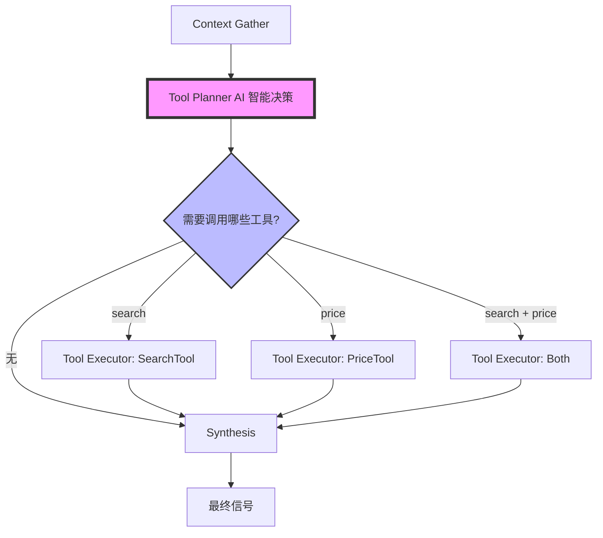

# PriceTool 集成到 LangGraph 深度分析流程总结

**完成日期**: 2025-10-12
**任务**: 将 PriceTool 集成到 LangGraph Tool Executor，支持深度分析流程拉取价格证据

---

## 完成的工作

### 1. 测试环境配置
- ✅ 在 `requirements.txt` 中添加了 `pytest>=8.0.0`
- ✅ 修复了 `tests/ai/tools/test_price_tool.py` 中的测试 bug
  - 问题: `fake_build_snapshot` 被错误地定义为 async 函数
  - 修复: 改为同步函数
- ✅ 使用 `uvx --with-requirements requirements.txt python -m pytest` 运行测试
- ✅ 所有单元测试通过 (2/2)

### 2. PriceTool 初始化集成
**文件**: `src/ai/deep_analysis/gemini.py`

在 `GeminiDeepAnalysisEngine.__init__()` 中添加了 PriceTool 的初始化逻辑：
- 添加 `self._price_tool` 属性
- 根据 `TOOL_PRICE_ENABLED` 配置决定是否初始化
- 从 `DEEP_ANALYSIS_PRICE_PROVIDER` 读取 provider 配置
- 添加初始化日志输出

```python
# Initialize price tool if enabled
tool_price_enabled = getattr(config, "TOOL_PRICE_ENABLED", False) if config else False
if config and tool_price_enabled:
    from src.ai.tools import PriceTool
    self._price_tool = PriceTool(config)
    logger.info("💰 价格工具已初始化，Provider=%s", provider)
```

### 3. ToolExecutorNode 扩展
**文件**: `src/ai/deep_analysis/nodes/tool_executor.py`

#### 3.1 添加 price 工具处理分支
在 `execute()` 方法中添加：
```python
elif tool_name == "price":
    result = await self._execute_price(state)
    if result:
        updates["price_evidence"] = result
```

#### 3.2 实现 `_execute_price()` 方法
- 检查 `self.engine._price_tool` 是否已初始化
- 从 `state["preliminary"].asset` 获取资产代码
- 跳过无效资产 (`NONE` 或空值)
- 调用 `price_tool.snapshot(asset=...)`
- 返回标准化的证据格式

### 4. 状态定义更新
**文件**: `src/ai/deep_analysis/gemini.py`

在 `DeepAnalysisState` TypedDict 中添加：
```python
price_evidence: Optional[dict]
```

在初始状态中添加：
```python
initial_state = DeepAnalysisState(
    ...
    price_evidence=None,
    ...
)
```

### 5. 证据格式化
**文件**: `src/ai/deep_analysis/helpers/formatters.py`

添加 `format_price_evidence()` 函数，格式化价格数据为可读文本：
- 显示资产、当前价格、偏离锚定价、24h 变动等指标
- 显示异常检测标志（稳定币脱锚、波动率异常、资金费率极端）
- 处理空数据情况

### 6. Prompt 增强
**文件**: `src/ai/deep_analysis/helpers/prompts.py`

#### 6.1 导入新的格式化函数
```python
from .formatters import format_price_evidence
```

#### 6.2 更新 `build_synthesis_prompt()`
- 添加 `price_ev = state.get("price_evidence", {})`
- 格式化价格证据: `price_text = format_price_evidence(price_ev)`
- 在 prompt 中添加【价格数据】章节

#### 6.3 添加价格相关的置信度调整规则
```
- 价格数据异常 (price_depeg=true 或 volatility_spike=true):
  → 提升 +0.10 to +0.15, 验证事件真实性

- 价格数据正常但事件类型为 depeg/liquidation:
  → 降低 -0.15 to -0.25, 标记 data_conflict
```

### 7. Tool Planner AI 智能决策 ⭐ 新增
**文件**: `src/ai/deep_analysis/nodes/tool_planner.py`, `src/ai/deep_analysis/helpers/prompts.py`

#### 7.1 简化 Tool Planner，移除硬编码规则
**变更**:
- ❌ 删除硬编码的白名单/黑名单: `FORCE_SEARCH_EVENT_TYPES`, `NEVER_SEARCH_EVENT_TYPES`
- ❌ 删除硬编码的决策逻辑
- ✅ 完全由 AI 根据 prompt 智能决策

**修改前** (硬编码规则):
```python
if preliminary.event_type in NEVER_SEARCH_EVENT_TYPES:
    return {"next_tools": []}
if preliminary.event_type in FORCE_SEARCH_EVENT_TYPES:
    return {"next_tools": ["search"]}
```

**修改后** (AI 智能决策):
```python
# Use AI Function Calling for intelligent decision making
# No hardcoded rules - AI decides based on message content and context
return await self._decide_with_function_calling(state)
```

#### 7.2 更新 Tool Definition 支持 Price Tool
```python
"tools": {
    "type": "ARRAY",
    "items": {"type": "STRING"},
    "description": "需要调用的工具列表,可选值: search, price",
}
```

#### 7.3 增强 Planner Prompt，添加 AI 决策规则

**添加的决策指南**:

**search 工具**:
- **必须搜索**: hack/regulation/partnership/listing，传闻消息
- **无需搜索**: 已有搜索结果，调用次数达上限，高相似度记忆，低价值事件

**price 工具**:
- **必须获取**: depeg/liquidation/volatility，价格暴涨暴跌，稳定币事件
- **可选获取**: listing/hack/regulation - 查看价格反应
- **无需获取**: 已有价格数据，资产无效，无价格影响

**5 个决策示例**:
1. 稳定币脱锚 → tools=["price"]
2. 交易所上线 → tools=["search", "price"]
3. 黑客攻击 → tools=["search", "price"]
4. 价格暴涨传闻 → tools=["search", "price"]
5. 低价值事件 + 高记忆匹配 → tools=[]

---

## 集成测试结果

✅ **导入测试**: 所有模块导入成功
✅ **PriceTool 功能测试**:
- PriceTool 初始化成功
- snapshot() 方法返回正确的 ToolResult 类型
- format_price_evidence() 正确格式化价格数据
- 空数据处理正常

✅ **Tool Planner 功能测试**:
- Tool Definition 包含 "search" 和 "price"
- Prompt 包含完整的决策规则和示例
- 生成的 prompt 长度: 2496 字符
- AI 可以根据消息内容智能决策工具调用

---

## 配置要求

启用价格工具需要在 `.env` 中设置：

```bash
# 启用价格工具
TOOL_PRICE_ENABLED=true

# Provider 配置
DEEP_ANALYSIS_PRICE_PROVIDER=coingecko

# CoinGecko API 配置
COINGECKO_API_KEY=your-api-key-here
COINGECKO_API_BASE_URL=https://api.coingecko.com/api/v3

# 价格异常阈值配置
PRICE_DEVIATION_THRESHOLD=2.0
PRICE_STABLECOIN_TOLERANCE=0.5
PRICE_VOLATILITY_SPIKE_MULTIPLIER=3.0
```

---

## 文件清单

### 新增文件
- `src/ai/tools/price/__init__.py` - PriceTool 包初始化
- `src/ai/tools/price/fetcher.py` - PriceTool 主类
- `src/ai/tools/price/providers/` - Provider 实现
- `tests/ai/tools/test_price_tool.py` - 单元测试

### 修改文件
- `requirements.txt` - 添加 pytest
- `src/ai/deep_analysis/gemini.py` - 添加 PriceTool 初始化，添加 price_evidence 状态字段
- `src/ai/deep_analysis/nodes/tool_executor.py` - 添加 _execute_price 方法
- `src/ai/deep_analysis/nodes/tool_planner.py` - ⭐ 移除硬编码规则，改为 AI 智能决策，添加 price 工具支持
- `src/ai/deep_analysis/helpers/formatters.py` - 添加 format_price_evidence
- `src/ai/deep_analysis/helpers/prompts.py` - ⭐ 更新 planner prompt 添加 price 决策规则，更新 synthesis prompt

---

## 工作流程



**关键特性**:
- ⭐ Tool Planner 使用 AI Function Calling 智能决策
- ⭐ 无硬编码规则，完全基于消息内容和上下文
- ⭐ 支持多工具并行调用 (search + price)
- ⭐ 成本意识：优先使用已有证据，避免重复调用

---

## 下一步工作建议

1. ✅ ~~添加 Tool Planner 规则~~ - **已完成！AI 智能决策已实现**
2. **端到端真实测试** ⭐ 推荐下一步:
   - 配置真实的 CoinGecko API key
   - 配置真实的 Tavily API key
   - 启用工具: `TOOL_PRICE_ENABLED=true`, `TOOL_SEARCH_ENABLED=true`, `DEEP_ANALYSIS_TOOLS_ENABLED=true`
   - 运行真实消息测试完整 LangGraph 流程
3. **监控和日志优化**:
   - 添加价格工具调用成功率监控
   - 添加 Tool Planner 决策分布统计
   - 记录工具调用对置信度的影响
4. **成本优化**:
   - 分析工具调用频率和成本
   - 调整 `DEEP_ANALYSIS_TOOL_DAILY_LIMIT` 配额
   - 优化 prompt 减少不必要的工具调用

---

## 相关文档

- [Phase 1 Search Tool Implementation](./phase1_search_tool_implementation_cn.md)
- [Deep Analysis Tools Integration Plan](./deep_analysis_tools_integration_plan.md)
- [CLAUDE.md](../CLAUDE.md) - 项目架构说明
